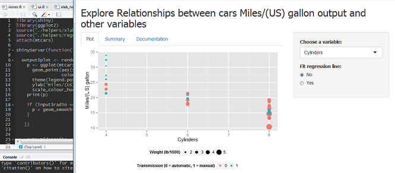

## The problem

- You have a specific task to analyze relationships between one particular variable and a set of others. For example, you are interested in miles per gallon output of a car and what might affect it. 
- You have to present your conclusions and the way you came up with them to general public.
- And then you see this:

```{r}
head(mtcars)
```


--- .class #id 

## What would you do?

- You know that the best way to do this is to make lots of plots and linear models. But how would you explain to general public the way came up with this pretty plot?

```{r, echo=FALSE, dev='CairoPNG'}
library(Cairo)
library(ggplot2)
p <- ggplot(mtcars, aes(x=wt, y=mpg)) + 
      geom_point(aes(size=wt,
                 color=factor(am))) +
      theme(legend.position = "bottom") +
      scale_colour_hue(name = "Transmission (0 = automatic, 1 = manual)") + scale_size(name = "Weight (lb/1000)") +
  geom_smooth(method = "lm")
    print(p)
```

---

## You need a shiny app!

<p class=left><small><a href="http://thinkingaboutbears.tumblr.com/image/118777229359">thinkingaboutbears.tumblr.com</a></small></p>

- The app must allow to plot different variables against mpg variable.
- It also should allow to fit linear models and show their summaries as well as plot them.

---

## Introducing MPG-app!



- Try it here [https://pased.shinyapps.io/mpg-app/](https://pased.shinyapps.io/mpg-app/)

---

## Source and documentation

- You can checkout the code here: [https://github.com/pased/mpg-app](https://github.com/pased/mpg-app)
- The documentation is available in the 'Documentation' tab of the app.
